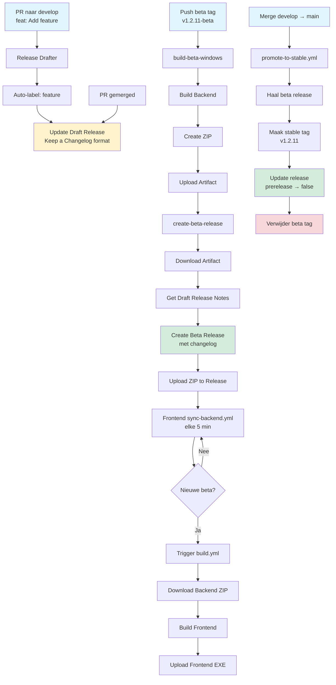
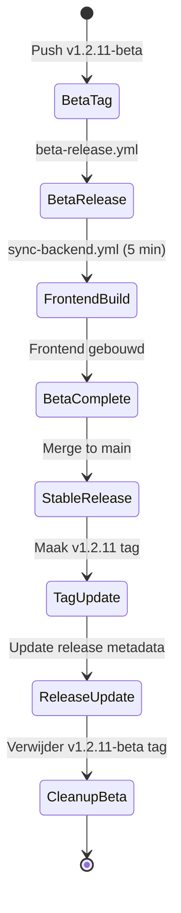
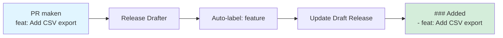
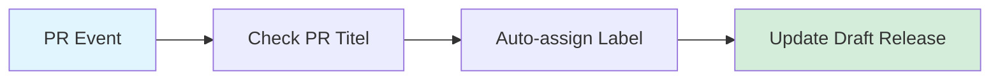
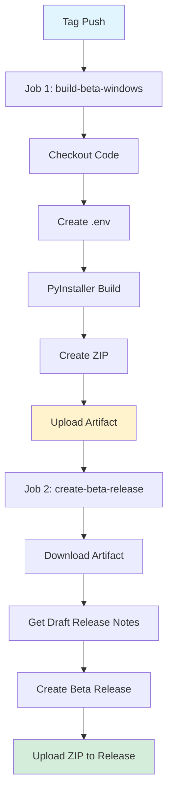
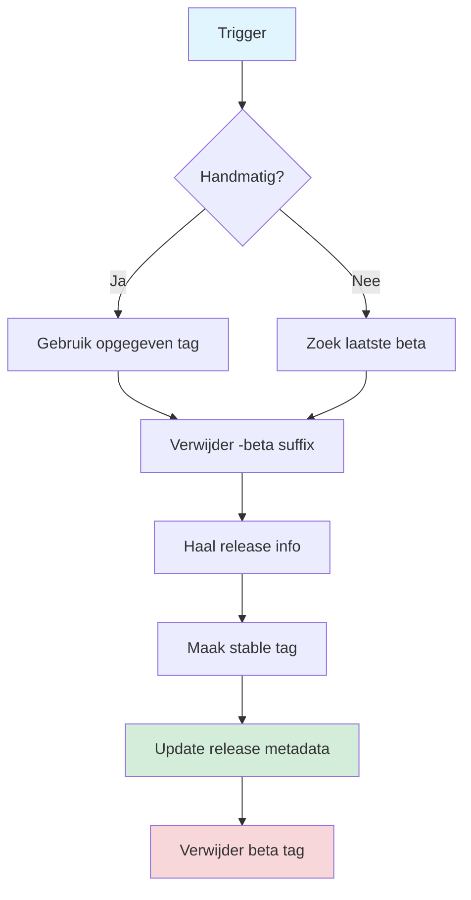
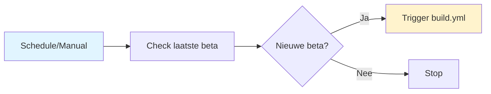
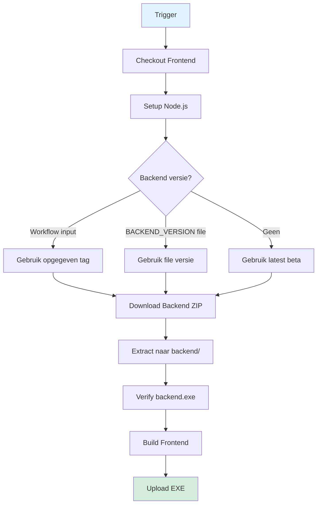
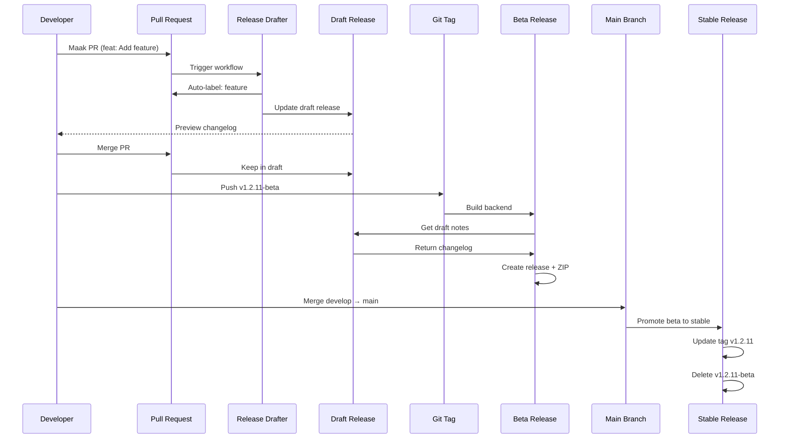

# Workflow Documentation - Carmenda Pseudonymize

## Overzicht

Dit document beschrijft de volledige CI/CD workflow voor het bouwen en releasen van de Carmenda Pseudonymize tool (backend + frontend), inclusief automatische changelog generatie via Release Drafter.

---

## 📋 Inhoudsopgave

1. [Workflow Schema](#workflow-schema)
2. [Release Drafter - Changelog Automation](#release-drafter---changelog-automation)
3. [Backend Workflows](#backend-workflows)
4. [Frontend Workflows](#frontend-workflows)
5. [Release Proces](#release-proces)
6. [Handmatig Testen](#handmatig-testen)

---

## 🔄 Workflow Schema

### Complete Release Flow met Release Drafter



### Tag en Release Lifecycle



---

## � Release Drafter - Changelog Automation

### Wat is Release Drafter?

Release Drafter genereert automatisch changelog notes in Keep a Changelog format op basis van PR titels en labels.

### Workflow



### PR Titel Conventies

| Titel Prefix | Auto Label | Changelog Sectie |
|--------------|------------|------------------|
| `feat:` `feature:` `add:` | `feature` | **### Added** |
| `fix:` `bug:` `bugfix:` | `bug` | **### Fixed** |
| `update:` `upgrade:` `bump:` | `update` | **### Changed** |
| `refactor:` | `refactor` | **### Changed** |
| `change:` `modify:` | `change` | **### Changed** |
| `enhance:` `improve:` | `enhancement` | **### Added** |
| Bevat `security` of `CVE` | `security` | **### Security** |
| `remove:` `delete:` | `removal` | **### Removed** |
| `docs:` `doc:` | `documentation` | (uitgesloten) |
| `chore:` | `chore` | (uitgesloten) |

### Voorbeeld Workflow

```bash
# 1. Maak feature branch
git checkout -b feature/add-csv-export

# 2. Ontwikkel feature
git add .
git commit -m "Add CSV export functionality"
git push origin feature/add-csv-export

# 3. Maak PR via GitHub UI
# Titel: "feat: Add CSV export functionality"
# → Label "feature" wordt automatisch toegevoegd
# → Draft release wordt bijgewerkt onder "### Added"

# 4. PR wordt gemerged
# → Draft release blijft beschikbaar

# 5. Bij beta tag push wordt draft als release notes gebruikt
```

### Draft Release Voorbeeld

Na enkele PRs ziet de draft release er zo uit:

```markdown
## [1.2.11] - 2026-01-22

### Added

- feat: Add CSV export functionality (#125)
- feat: Add real-time notifications (#126)

### Changed

- update: Upgrade Polars to v2.0 (#127)
- refactor: Simplify API logic (#128)

### Fixed

- fix: Resolve UTF-8 encoding issue (#129)
- fix: Handle null values properly (#130)
```

---

## 🔧 Backend Workflows

### 1. Release Drafter Workflow

**Bestand:** `.github/workflows/release-drafter.yml`

**Trigger:** Pull request naar `develop` branch

**Acties:**


**Belangrijke stappen:**
1. Analyseert PR titel (case-insensitive)
2. Voegt automatisch juiste label toe
3. Update draft release met PR info
4. Groepeert in Keep a Changelog categorieën

**Config:** `.github/release-drafter.yml`
- Template voor Keep a Changelog format
- Autolabeler regels
- Version resolver (major/minor/patch)

---

### 2. Beta Release Workflow

### 2. Beta Release Workflow

**Bestand:** `.github/workflows/beta-release.yml`

**Trigger:** Push van tag met patroon `v*-beta` (bijv. `v1.2.11-beta`)

**Acties:**


**Job 1: build-beta-windows**
1. Checkout code
2. Maak dummy `.env` file voor build
3. Build met PyInstaller (Python 3.13.9)
4. Maak ZIP: `Privacytool_backend_windows_v1.2.11-beta.zip`
5. Upload als artifact

**Job 2: create-beta-release**
1. Download build artifact
2. Haal draft release notes op via GitHub API
3. Fallback naar simpele notes als geen draft
4. Maak pre-release met draft notes (Keep a Changelog!)
5. Upload ZIP naar release

**Output:**
- Pre-release op GitHub met tag `v*-beta`
- ZIP bestand met backend executable
- Release notes in Keep a Changelog format

**Let op:** Build draait ALTIJD eerst, release alleen bij succesvolle build!

---

### 3. Promote to Stable Workflow

**Bestand:** `.github/workflows/promote-to-stable.yml`

**Trigger:** 
- Automatisch bij merge naar `main` branch
- Handmatig via workflow_dispatch (met beta tag input)

**Acties:**


**Belangrijke stappen:**
1. Bepaal welke beta te promoten (automatisch of handmatig)
2. Verwijder `-beta` suffix: `v1.2.11-beta` → `v1.2.11`
3. Haal release info van beta op
4. Maak nieuwe stable tag (wijst naar zelfde commit)
5. Update release: `prerelease: false`, nieuwe tag_name
6. Verwijder oude beta tag

**Geen nieuwe build:** Hergebruikt bestaande ZIP van beta release!

**Let op:** Changelog blijft exact hetzelfde, alleen tag en release status veranderen.

---

## 🎨 Frontend Workflows

**Locatie:** Deze workflows staan in de frontend repository (`carmenda_pseudonymize_frontend`)

### 1. Sync Backend Workflow

**Bestand:** `.github/workflows/sync-backend.yml`

**Trigger:**
- Schedule: elke 5 minuten (`*/5 * * * *`)
- Handmatig via workflow_dispatch

**Acties:**


**Belangrijke stappen:**
1. Haal alleen **beta releases** op (prerelease = true)
2. Check laatste beta tag
3. Trigger `build.yml` met backend tag als parameter

**Let op:** Stable releases worden genegeerd!

---

### 2. Build Frontend Workflow

**Bestand:** `.github/workflows/build.yml`

**Trigger:**
- Push naar `main` of `test` branch
- Pull request naar `main`
- Handmatig via workflow_dispatch
- **Automatisch getriggerd door sync-backend.yml**

**Acties:**


**Backend versie prioriteit:**
1. **Workflow input** (van sync-backend.yml)
2. **BACKEND_VERSION** file in frontend repo
3. **Latest beta release** (fallback)

**Belangrijke stappen:**
1. Checkout frontend repository
2. Setup Node.js 18
3. Bepaal backend versie
4. Download backend: `Privacytool_backend_windows_*.zip`
5. Extract naar `backend/` directory
6. Verify `backend/dist/backend.exe` bestaat
7. Build frontend met `npm run build:win`
8. Upload EXE als artifact

---

## 📦 Release Proces

### Complete Workflow: Van PR tot Stable Release



### Beta Release Maken (met Release Drafter)

**Stap 1: Ontwikkel features in PRs**

```bash
# Maak feature branch
git checkout develop
git pull origin develop
git checkout -b feature/add-csv-export

# Ontwikkel feature
# ... code wijzigingen ...
git add .
git commit -m "Add CSV export functionality"
git push origin feature/add-csv-export
```

**Stap 2: Maak PR via GitHub UI**

1. Ga naar GitHub repository
2. Pull requests → New pull request
3. Base: `develop` ← Compare: `feature/add-csv-export`
4. **Titel:** `feat: Add CSV export functionality` (belangrijk!)
5. Beschrijving invullen
6. Create pull request

**✅ Automatisch gebeurt:**
- Label `feature` wordt toegevoegd
- Draft release wordt bijgewerkt:
  ```markdown
  ### Added
  - feat: Add CSV export functionality (#125)
  ```

**Stap 3: Herhaal voor meer features/fixes**

Elke PR met correcte titel wordt automatisch toegevoegd aan draft release.

**Stap 4: Check Draft Release**

https://github.com/Carmenda-nl/carmenda_pseudonymize_core/releases

Je ziet een Draft met alle PRs gegroepeerd:
```markdown
## [1.2.11] - 2026-01-22

### Added
- feat: Add CSV export functionality (#125)
- feat: Add WebSocket notifications (#126)

### Changed
- update: Upgrade Polars to v2.0 (#127)

### Fixed
- fix: Resolve encoding issue (#129)
```

**Stap 5: Maak Beta Tag**

```bash
# Wanneer klaar voor beta release
git checkout develop
git pull origin develop
git tag v1.2.11-beta
git push origin v1.2.11-beta
```

**✅ Beta-release workflow doet:**
1. Build backend → ZIP
2. Haal draft release notes op
3. Maak pre-release met changelog in Keep a Changelog format
4. Upload ZIP

**Resultaat:**
- Backend: `Privacytool_backend_windows_v1.2.11-beta.zip`
- Release notes: Perfect geformatteerde changelog
- Frontend sync pikt het binnen 5 minuten op
- Frontend wordt gebouwd

---

### Beta Promoten naar Stable

**Optie 1: Automatisch (bij merge naar main)**

```bash
# 1. Merge develop naar main
git checkout main
git pull origin main
git merge develop
git push origin main

# 2. GitHub Actions doet de rest:
#    - Laatste beta wordt gepromoot
#    - Stable tag v1.2.11 wordt aangemaakt
#    - Release wordt stable (prerelease = false)
#    - Beta tag wordt verwijderd
```

**Optie 2: Handmatig testen (zonder merge)**

1. Ga naar GitHub → Actions
2. Selecteer "Promote Beta to Stable"
3. Klik "Run workflow"
4. Vul in:
   - Branch: `develop` (of test branch)
   - Beta tag: `v1.2.11-beta`
5. Klik "Run workflow"

**Resultaat:**
- Tag `v1.2.11-beta` wordt verwijderd
- Tag `v1.2.11` wordt aangemaakt (wijst naar zelfde commit)
- Release wordt stable
- **Zelfde ZIP wordt hergebruikt** (geen nieuwe build!)

---

## 🧪 Handmatig Testen

### Test Beta Release

```bash
# Maak test tag
git tag v0.0.1-beta-test
git push origin v0.0.1-beta-test

# Volg workflow in GitHub Actions
# Check of pre-release wordt aangemaakt
```

### Test Promote to Stable

1. GitHub → Actions → "Promote Beta to Stable"
2. Run workflow (handmatig)
3. Input: `v0.0.1-beta-test`
4. Controleer:
   - ✅ Tag `v0.0.1-test` is aangemaakt
   - ✅ Release is stable (geen "Pre-release" badge)
   - ✅ Tag `v0.0.1-beta-test` is verwijderd

### Test Frontend Sync

1. Wacht maximaal 5 minuten na beta release
2. GitHub → carmenda_pseudonymize_frontend → Actions
3. Check of "Sync Backend" is gestart
4. Check of "Build Frontend" is getriggerd

---

## 🔐 Secrets & Configuratie

### Backend Repository

**Geen secrets nodig!** Gebruikt alleen standaard `GITHUB_TOKEN`.

### Frontend Repository

**Geen secrets nodig!** 
- Standaard `GITHUB_TOKEN` voor workflow triggers
- Backend releases zijn publiek toegankelijk via GitHub API

### GitHub Labels (Eenmalig Setup)

Labels zijn al aangemaakt in de repository. Als je ze opnieuw moet maken:

**Benodigde labels:**
- `feature` - New feature or functionality (Added)
- `enhancement` - Enhancement to existing feature (Added)
- `bug` - Bug fix (Fixed)
- `fix` - General fix (Fixed)
- `change` - Change in functionality (Changed)
- `update` - Update packages or dependencies (Changed)
- `refactor` - Code refactoring (Changed)
- `deprecated` - Deprecated features (Deprecated)
- `removal` - Removed features (Removed)
- `security` - Security related (Security)
- `documentation` - Documentation only (uitgesloten)
- `chore` - Maintenance tasks (uitgesloten)
- `skip-changelog` - Skip this PR in changelog
- `breaking-change` - Breaking changes (major version bump)

---

## 📝 PR Best Practices

### Goede PR Titels

✅ **Goed:**
- `feat: Add CSV export functionality`
- `fix: Resolve UTF-8 encoding in parser`
- `update: Upgrade Django to 5.0`
- `refactor: Simplify API error handling`
- `security: Patch SQL injection vulnerability`

❌ **Slecht:**
- `Updates` (te vaag, geen prefix)
- `Fix bug` (geen details)
- `WIP: Testing` (Work in Progress)
- `Merge branch 'develop'` (merge commits)

### PR Titel Format

```
<type>: <description>

Types:
- feat/feature/add     → Added
- fix/bug/bugfix       → Fixed  
- update/upgrade/bump  → Changed
- refactor             → Changed
- change/modify        → Changed
- enhance/improve      → Added
- remove/delete        → Removed
- security             → Security
- docs/doc             → Excluded
- chore                → Excluded
```

### Tips

1. **Wees specifiek:** "feat: Add CSV export" is beter dan "feat: Add export"
2. **Eén feature per PR:** Makkelijker voor review en changelog
3. **Link issues:** "fix: Resolve encoding (#123)" koppelt aan issue
4. **Case-insensitive:** `feat:`, `Feat:`, `FEAT:` werken allemaal
5. **Check draft release:** Zie meteen hoe je PR in changelog komt

---

## 📝 Bestandsoverzicht

### Backend Repository

```
.github/workflows/
├── beta-release.yml          # Beta build bij tag push
└── promote-to-stable.yml     # Promoot beta naar stable

build.spec                    # PyInstaller configuratie
app/
├── .env                      # (niet in repo, wordt tijdens build aangemaakt)
├── requirements.txt          # Python dependencies
└── ...
```

### Frontend Repository

```
.github/workflows/
├── sync-backend.yml          # Check elke 5 min op nieuwe beta
└── build.yml                 # Build frontend met backend

privacytool/
├── BACKEND_VERSION           # (optioneel) Specifieke backend versie
├── package.json
└── ...
```

---

## ⚙️ Configuratie Details

### Environment Variables (Build tijd)

**Backend .env (tijdens build):**
```env
DJANGO_RUNSERVER_HIDE_WARNING=true
DEBUG=False
LOG_LEVEL=INFO
SECRET_KEY=build-dummy-secret-key-<commit-sha>
CSRF_TRUSTED_ORIGINS=http://127.0.0.1
JOB_LOG_ONLY=True
```

### Workflow Timings

| Workflow | Trigger | Frequentie |
|----------|---------|------------|
| beta-release.yml | Tag push | On-demand |
| promote-to-stable.yml | Merge to main | On-demand |
| sync-backend.yml | Schedule | Elke 5 minuten |
| build.yml | Triggered | Na sync-backend |

---

## 🚨 Troubleshooting

### Backend build faalt

**Error:** `RecursionError: maximum recursion depth exceeded`

**Oplossing:** Check of `.env` file correct wordt aangemaakt in workflow

### Frontend kan backend niet downloaden

**Error:** `No backend asset found`

**Check:**
1. Is er een beta release beschikbaar?
2. Is de ZIP naam correct: `Privacytool_backend_windows_*.zip`?
3. Is de backend repository publiek?

### Promote to stable faalt

**Error:** `No beta release found`

**Oplossing:** Zorg dat er minimaal één pre-release met `-beta` suffix bestaat

### Frontend sync triggert niet

**Check:**
1. Is sync-backend.yml in de frontend repository?
2. Draait de schedule? (GitHub Actions → sync-backend → runs)
3. Zijn er beta releases beschikbaar?

---

## 📌 Belangrijke Opmerkingen

1. **Alleen beta's worden gebouwd** - Stable releases zijn promoties van beta's
2. **Geen PAT nodig** - Workflows werken met standaard `GITHUB_TOKEN`
3. **Backend moet publiek zijn** - Frontend haalt releases op via publieke GitHub API
4. **ZIP naam is belangrijk** - Moet `Privacytool_backend_windows_*.zip` zijn
5. **5 minuten delay** - Frontend sync draait elke 5 minuten, geen instant trigger
6. **Beta tag cleanup** - Beta tags worden automatisch verwijderd bij promotie
7. **PR titels zijn cruciaal** - Bepalen automatisch label en changelog sectie
8. **Draft release is preview** - Check altijd draft voor tag push
9. **Build eerst, dan release** - Release wordt alleen gemaakt bij succesvolle build
10. **Keep a Changelog format** - Automatisch gegenereerd via Release Drafter

---

## 🎓 Quick Reference

### PR naar Beta Release Flow

```
1. PR (feat: Feature) → Auto-label → Draft update
2. PR gemerged → Draft blijft
3. Meer PRs → Draft groeit
4. Push v1.2.11-beta → Build → Release met draft notes
5. Frontend sync → Build frontend
```

### Beta naar Stable Flow

```
1. Merge develop → main
2. Auto-promote laatste beta
3. Tag v1.2.11-beta → v1.2.11
4. Release prerelease → stable
5. Beta tag verwijderd
```

### PR Titel → Changelog

| PR Titel | Label | Sectie |
|----------|-------|--------|
| `feat: Add feature` | feature | Added |
| `fix: Fix bug` | bug | Fixed |
| `update: Update deps` | update | Changed |
| `refactor: Refactor code` | refactor | Changed |
| `security: Patch CVE` | security | Security |

---

## 📅 Workflow Geschiedenis

| Versie | Datum | Wijziging |
|--------|-------|-----------|
| 2.0 | 2026-01-22 | Release Drafter integratie, build-first approach |
| 1.0 | 2026-01-22 | Initiele setup met beta/stable flow |

---

## 📚 Gerelateerde Documentatie

- [Release Drafter Setup Guide](.github/RELEASE_DRAFTER_SETUP.md)
- [Keep a Changelog](https://keepachangelog.com/)
- [Semantic Versioning](https://semver.org/)
- [Release Drafter](https://github.com/release-drafter/release-drafter)

